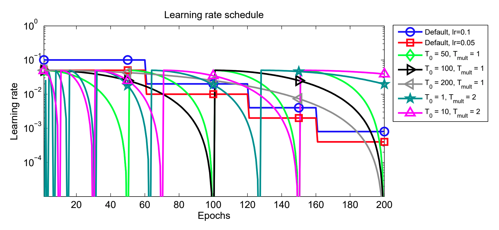
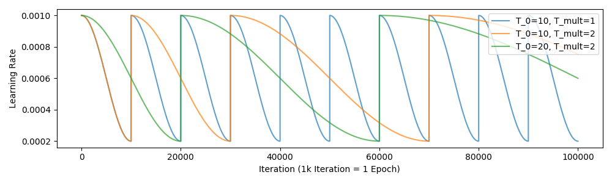
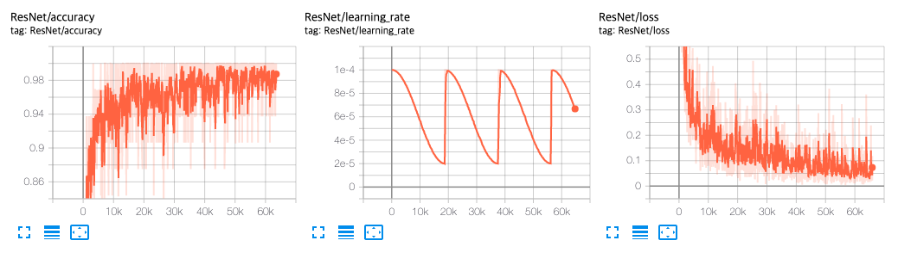

[TensorFlow 2] SGDR: Stochastic Gradient Descent with Warm Restarts
=====

## Related Repositories
<a href="https://github.com/YeongHyeon/ResNet-TF2">ResNet-TF2</a>  
<a href="https://github.com/YeongHyeon/ResNeXt-TF2">ResNeXt-TF2</a>  
<a href="https://github.com/YeongHyeon/WideResNet_WRN-TF2">WideResNet(WRN)-TF2</a>  
<a href="https://github.com/YeongHyeon/ResNet-with-LRWarmUp-TF2">ResNet-with-LRWarmUp-TF2</a>

## Concept
<div align="center">
    
  <p>Learning Rate Variation in SGDR [1].</p>
</div>

<div align="center">
    
  <p>Learning Rate Variation by 'function_sgdr.py'.</p>
</div>

## Training
<div align="center">
    
  <p>Accuracy, Loss, and Learning Rate graph in training procedure.</p>
</div>

## Performance

|Indicator|Value|
|:---|:---:|
|Accuracy|0.98620|
|Precision|0.98618|
|Recall|0.98606|
|F1-Score|0.98610|

```
Confusion Matrix
[[ 974    0    1    0    0    0    1    2    2    0]
 [   0 1131    1    1    0    2    0    0    0    0]
 [   2    4 1018    0    1    0    0    4    2    1]
 [   1    0    1  997    0    3    0    2    4    2]
 [   0    0    0    0  973    0    2    1    1    5]
 [   2    0    0    6    0  880    1    1    0    2]
 [   5    2    0    0    2    3  945    0    1    0]
 [   1    2    5    5    0    0    0 1009    1    5]
 [   9    1    1    2    2    2    3    6  945    3]
 [   2    3    0    2    6    3    0    1    2  990]]
Class-0 | Precision: 0.97791, Recall: 0.99388, F1-Score: 0.98583
Class-1 | Precision: 0.98950, Recall: 0.99648, F1-Score: 0.99298
Class-2 | Precision: 0.99124, Recall: 0.98643, F1-Score: 0.98883
Class-3 | Precision: 0.98421, Recall: 0.98713, F1-Score: 0.98566
Class-4 | Precision: 0.98882, Recall: 0.99084, F1-Score: 0.98983
Class-5 | Precision: 0.98544, Recall: 0.98655, F1-Score: 0.98599
Class-6 | Precision: 0.99265, Recall: 0.98643, F1-Score: 0.98953
Class-7 | Precision: 0.98343, Recall: 0.98152, F1-Score: 0.98247
Class-8 | Precision: 0.98643, Recall: 0.97023, F1-Score: 0.97826
Class-9 | Precision: 0.98214, Recall: 0.98117, F1-Score: 0.98166

Total | Accuracy: 0.98620, Precision: 0.98618, Recall: 0.98606, F1-Score: 0.98610
```

## Requirements
* Python 3.7.6  
* Tensorflow 2.1.0  
* Numpy 1.18.1  
* Matplotlib 3.1.3  

## Reference
[1] Ilya Loshchilov et al. (2016). <a href="https://arxiv.org/abs/1608.03983">SGDR: Stochastic Gradient Descent with Warm Restarts</a>. arXiv preprint arXiv:1608.03983.
